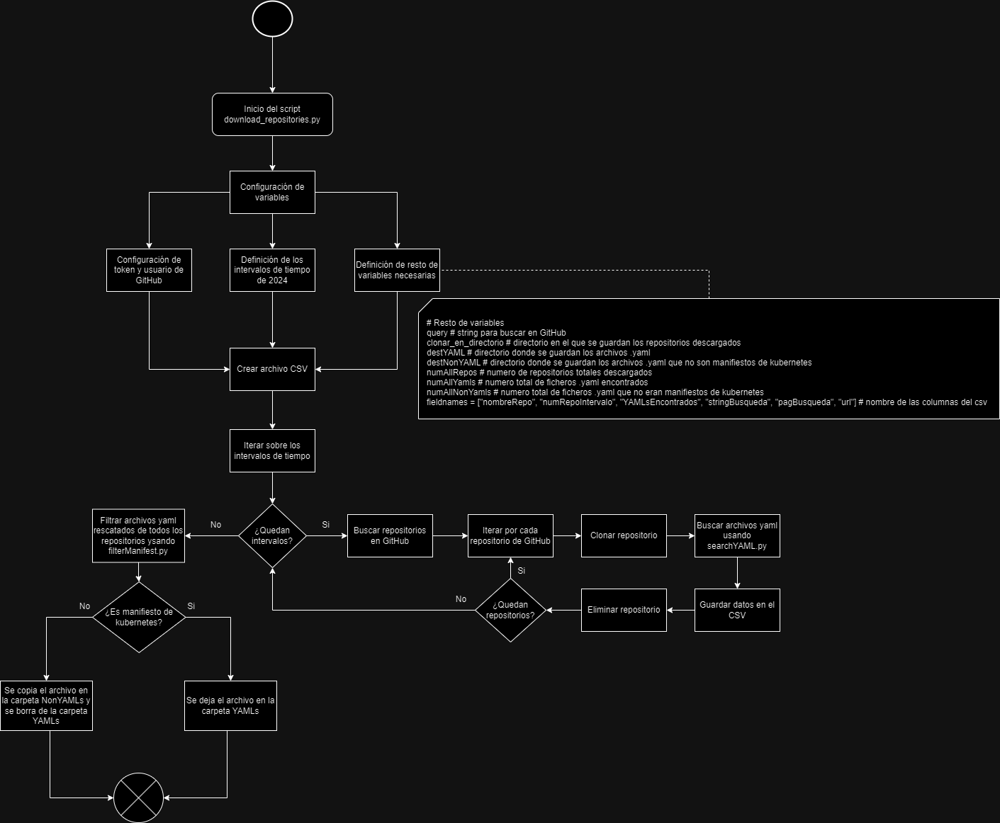

# Script de búsqueda en GitHub

Este script cumple con el objetivo de examinar repositorios de GitHub en busca de ficheros yaml, más concretamente manifiestos de kubernetes, creados durante el año 2024. De esta forma, los resultados son lo más recientes posibles. 

Los resultados de la ejecución son: 

- Carpeta “YAMLs”, donde se almacenan los manifiestos de Kubernetes. 

- Carpeta “NonYAMLs”, donde se almacenan los yaml que no eran manifiestos. 

- Fichero CSV, donde se guardan los datos de los repositorios examinados.

- Una salida por consola con los datos generales de la ejecución. 

# Otros scripts útiles

- El script "most_common_keys_YAMLs.py" analiza todos los archivos .yaml y guarda en un archivo csv una lista de las claves más comunes, ordenadas de mayor a menor número de apariciones.

- El script "extract_features_from_YAML" crea un archivo csv, donde cada fila almacena una lista de claves del archivo.yaml, si representa una configuracion valida, el archivo del que se ha obtenido la informacion y el numero total de claves encontradas en ese archivo.

- El script "valid_config.py" que dado una configuración en formato de lista y un modelo de características, comprueba si se trata de una configuración válida.

La comprobación de una configuracián válida se hace usando un FM y una tabla de mapping, que relaciona las características del modelo con la nomenclatura de las claves encontradas el el fichero yaml. La tabla de mapping tiene 3 columnas, la primera es el nombre de la caracteristica del arbol, la segunda es la nomenclatura que tendria esa caracteristica en la configuracion, y la tercera solo existe para aquellas caracteristicas que podrian aparecer de dos formas diferentes.

Por ejemplo, esto pasa en el caso de la caracteristica "spec". Puede representar a un DeploymentSpec, un PodSpec... y podria aparecer con la nomenclatura "podspec" (si se define solo un pod) o tambien "deploymentspec_template_spec" (si se define dentro de un deployment, que tambien tiene un spec). Para solucionar este problema de referencias, se añade un prefijo a "spec" indicando el tipo que es realmente (podspec, deploymentspec, servicespec...).

Además, es necesario obtener dos caracteristicas que solo aparecen en el archivo yaml como valores del campo "apiVersion". Estos son  "goup" y "version". Una funcion del script está dedicada a obtener estos valores para añadirlos como caracteristicas del modelo.


# Instalación y ejecución

```python
python -m venv env # Crear entorno virtual
pip install requirements.txt # Instalar dependencias
python <nombre-script>.py # Ejecutar el script
```

Es necesario crear un archivo .env para guardar el token privado de GitHub. Este token debe tener permisos para leer y descargar repositorios públicos.

```
github_token = 'XXXXX'
```

# Configuración Inicial del script download_repositories.py

- Se definen intervalos de tiempo para todo el año 2024, dividiéndolo en periodos de 10-11 días. El primer intervalo es el “2024-01-01..2024-01-10”, después el “2024-01-11..2024-01-20”, siendo el ultimo de todos el intervalo “created:2024-12-21..2024-12-31”. Esto supone 36 intervalos, y, por tanto, 36 búsquedas.
- Se establecen las configuraciones necesarias para realizar búsquedas en GitHub, como el token de autenticación y el nombre de usuario.
- Se definen varias variables para la gestión de repositorios y archivos YAML, así como los nombres de las columnas para un archivo CSV que almacenará los resultados.
    
    Las variables que se pueden configurar son:
    
    - github_user: Usuario de GitHub para acceder a la API
    - github_token: token privado de GitHub. Se debe almacenar en un archivo “.env”
    - query: Almacena la cadena de texto usada para buscar en GitHub
    - destYAML: ruta donde se copiarán los ficheros yaml
    - destNonYAML: ruta donde se almacenan los ficheros yaml que no sean manifiestos de Kubernetes
    
    A continuación, se explica el significado de cada columna del archivo CSV:
    
    - nombreRepo: Nombre del repositorio analizado
    - numRepoIntervalo: número del repositorio dentro del intervalo de tiempo en el que se ha encontrado.
    - YAMLsEncontrados: número de archivos yaml encontrados en ese repositorio
    - stringBusqueda: el valor de query (o búsqueda) en el que se ha encontrado el repositorio.
    - pagBusqueda: número de la página (de la respuesta de la API) en el que se ha encontrado el repositorio.
    - url: *endpoint* de la que se obtiene el resultado de búsqueda donde se ha encontrado este repositorio

# Funciones

- **remove_readonly(func, path, _):** Elimina los permisos de "solo lectura" de un archivo o directorio para permitir su eliminación.
- **buscar_repositorios(query, github_user, github_token, page, month):** Realiza una búsqueda en GitHub de repositorios que coincidan con la consulta y el intervalo de tiempo especificado.
- **archivo_en_uso(ruta):** Comprueba si un archivo o directorio está en uso por otro proceso.
- **eliminar_repo(ruta_repositorio):** Elimina un repositorio clonado.
- **clonar_repositorio(repo, directorio_destino):** Clona un repositorio de GitHub en el directorio especificado.
- **quitar_solo_lectura(directorio):** Elimina los permisos de solo lectura de un directorio y sus archivos.

# Proceso Principal

1. Creación del archivo CSV: Se abre un archivo CSV para escribir los resultados.
2. Iteración sobre los intervalos de tiempo: Para cada intervalo de tiempo definido:
3. Se busca en GitHub repositorios que coincidan con la consulta definida en la variable *“query”*.
4. Para cada repositorio encontrado:
- Se clona el repositorio.
- Se buscan archivos YAML en el repositorio clonado utilizando el módulo ***searchYAML***.
- Se elimina el repositorio clonado.
- Se registran los resultados en el archivo CSV.
1. Se repiten los pasos 3 y 4 hasta que se han recorrido todos los intervalos de tiempo.
2. Finalmente, se filtran los archivos YAML para descartar aquellos que no sean manifiestos de Kubernetes utilizando el módulo ***filterManifest***.

# Módulos

- **searchYAMLs:** Está diseñado para buscar archivos con extensión “.*yaml”* en una carpeta específica y copiar todos esos archivos a otra carpeta. Recibe como entrada la ruta donde se encuentra el repositorio a examinar y la ruta a la que se van a copiar los ficheros *yaml. Devuelve el numero de archivos encontrados.*
- **filterManifest:** está diseñado para verificar si los archivos YAML en una carpeta específica son manifiestos de Kubernetes. Esto se determina buscando las palabras clave *apiVersion* y *kind* (dos campos que son obligatorios en cualquier manifiesto de Kubernetes)[[1]](https://www.notion.so/Script-de-b-squeda-en-GitHub-0cde2be90d2a4b65897baab916f886ba?pvs=21) en el contenido de cada archivo. Los archivos que no son manifiestos de Kubernetes se mueven a otra carpeta. Recibe como entrada la ruta donde se encuentra los archivos *yaml* examinar y la ruta a la que se van a copiar los ficheros *yaml* que no sean manifiestos de Kubernetes. 

[[1]](https://www.notion.so/Script-de-b-squeda-en-GitHub-0cde2be90d2a4b65897baab916f886ba?pvs=21) Información obtenida de https://kubernetes.io/docs/concepts/overview/working-with-objects/#required-fields


